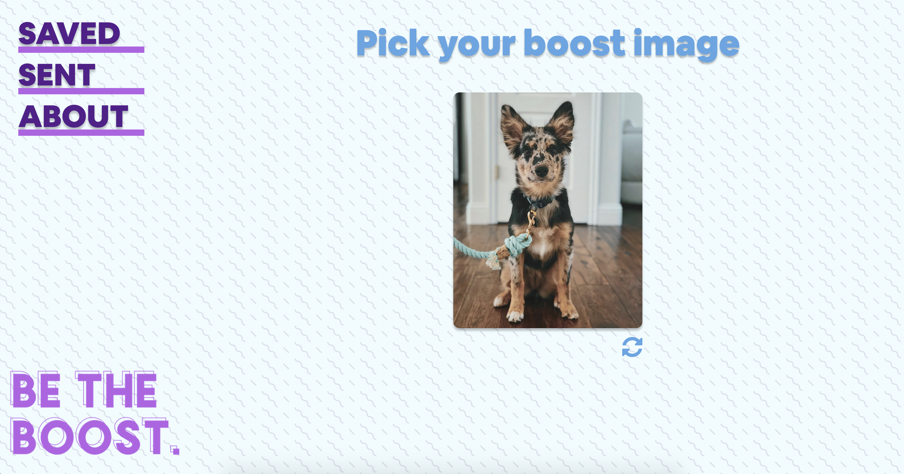
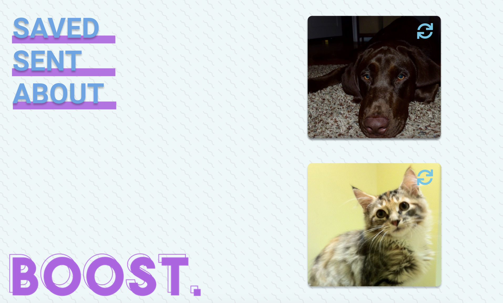
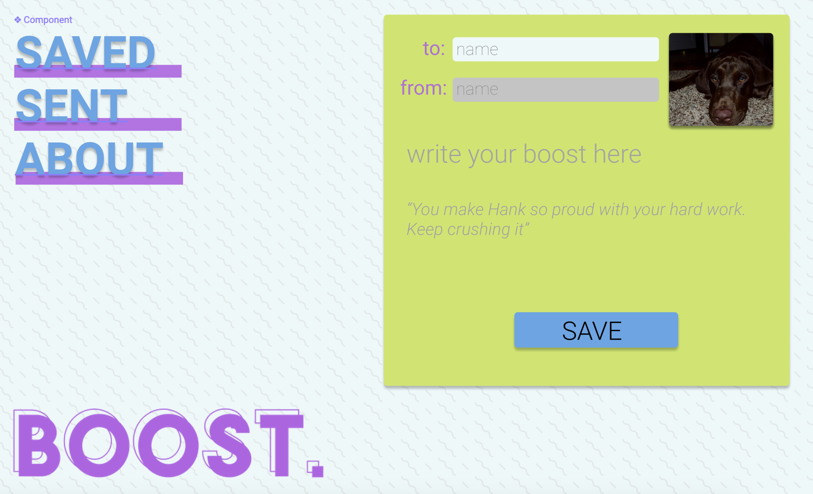

# Boost

Boost was designed for users that have sad friends that need boosting. A user will have the option to select the already populated animal or choose to fetch another.

## Setup front-end:

#### in your terminal:

- `git clone https://github.com/hillstew/boost.git`
- `npm install` from the root directory
- `npm start` and visit localhost:3000 in your browser

#### Tech Stack:

- React
- Redux
- Router
- Sass
- Node.js

#### Testing:

- Jest & Enzyme
- Run `npm test` from the root directory

### Final App

## Wireframes:

#### home

#### create boost

### [Original Assignment](http://frontend.turing.io/projects/binary-challenge.html)
